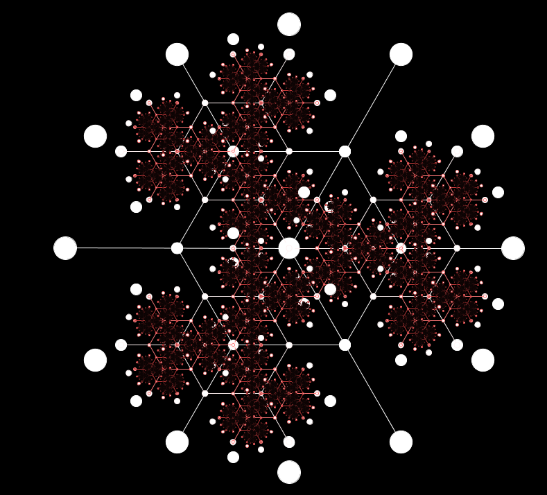
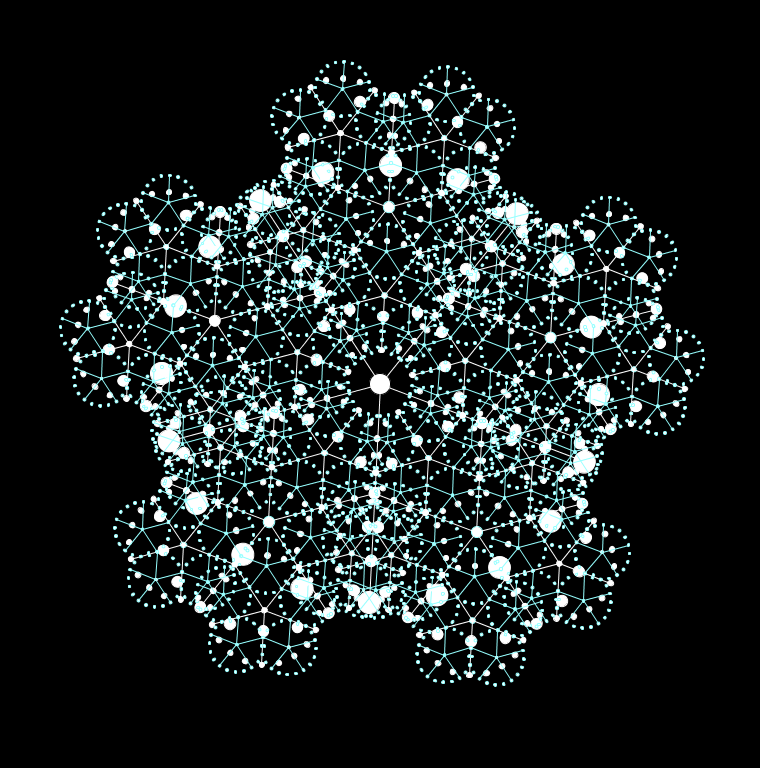
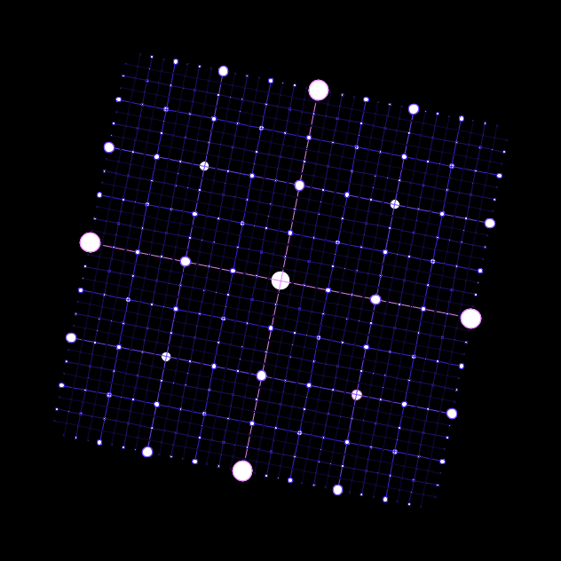
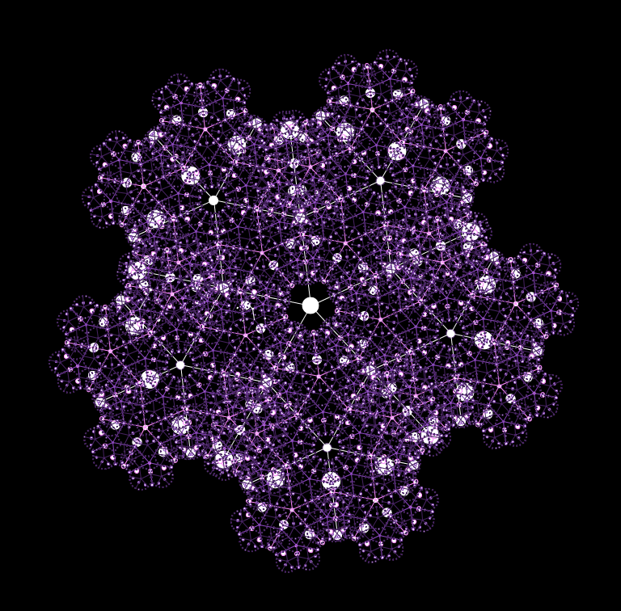
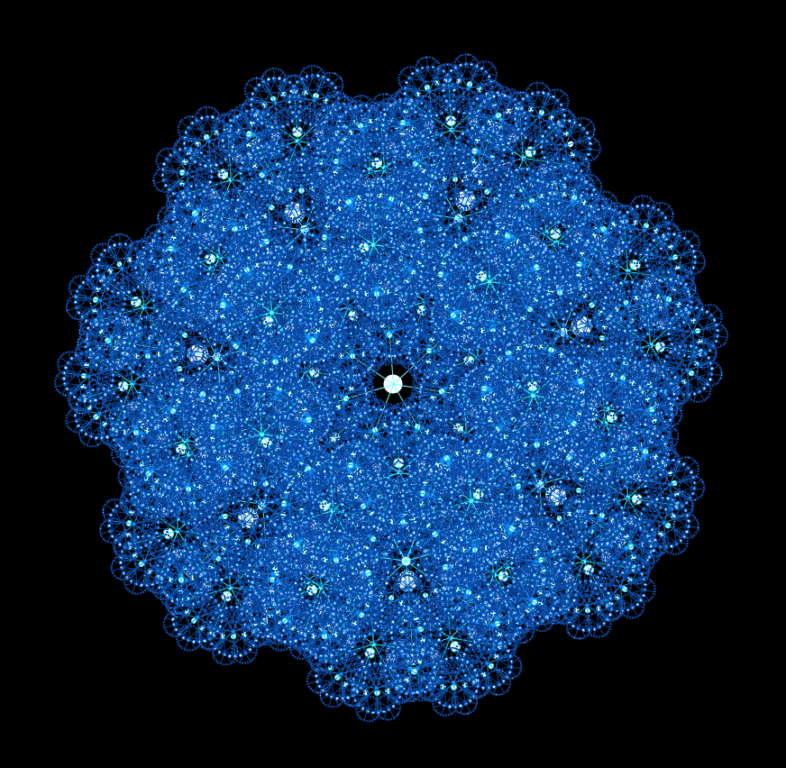
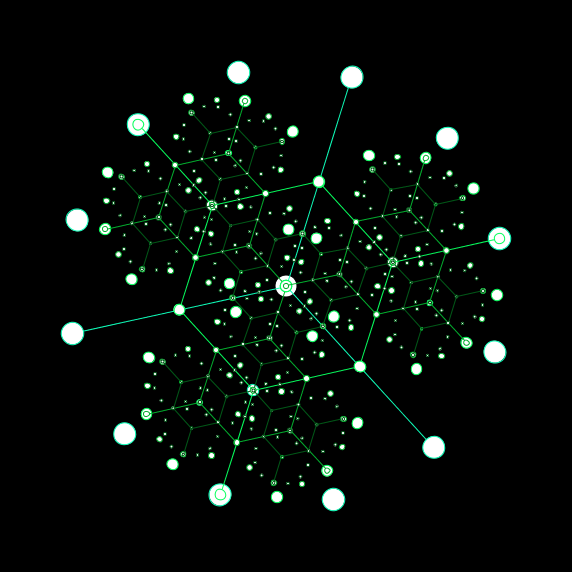
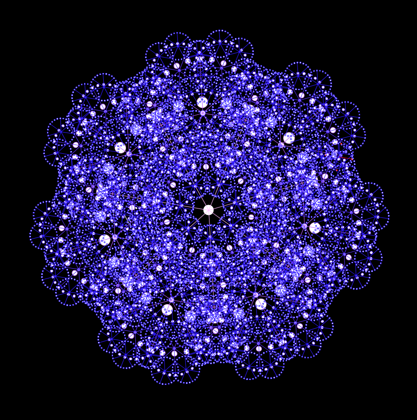
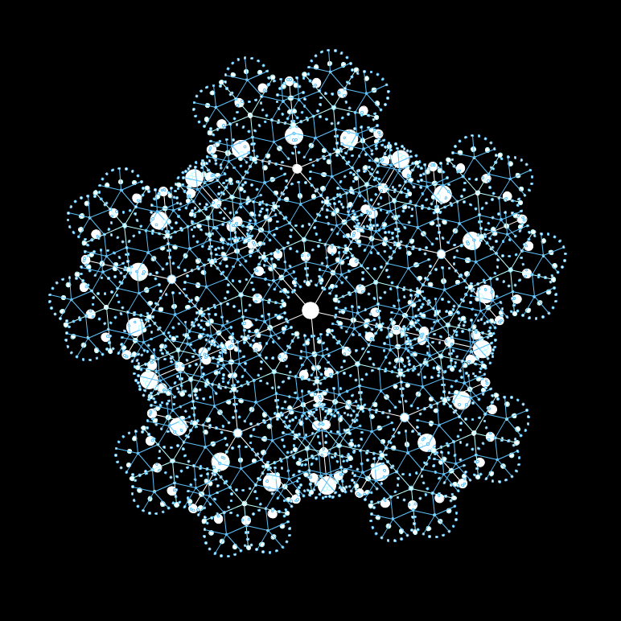

# Overview
This is a program that generates neat-looking recursive lattices.

# Usage
1. Ensure that [Processing](https://processing.org/) is installed.
2. Open and run [sources](sources) in your PDE.
3. Cycle through images one at a time, saving whichever you'd like.

# Samples

