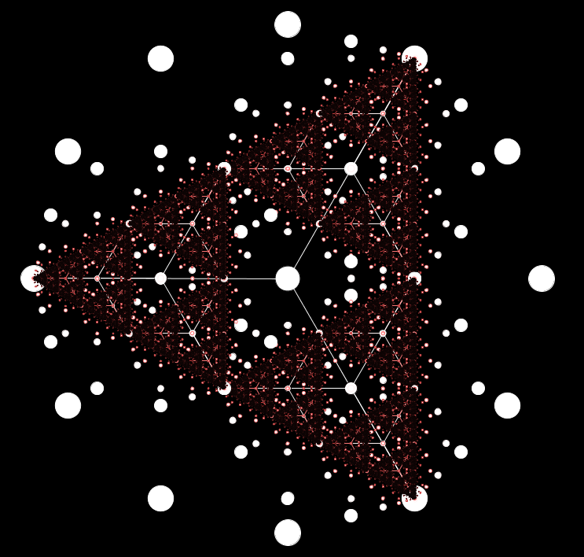
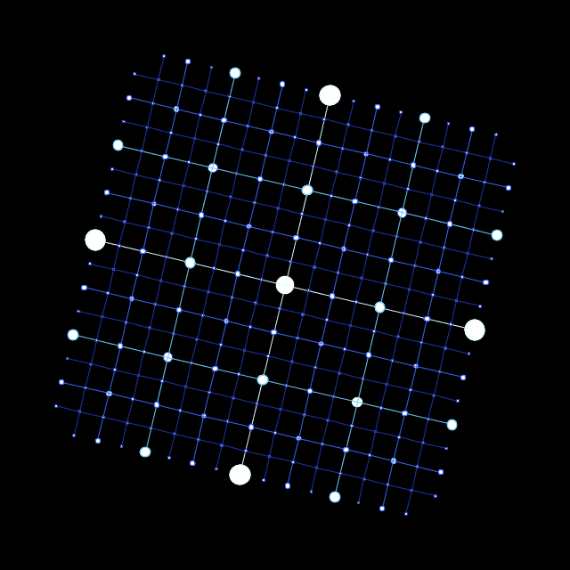

# Overview
This is a program that generates neat-looking recursive lattices.

# Usage
1. Ensure that you have [Processing](https://processing.org/) installed
2. Run `RecursiveLatticeGenerator.pde` in your PDE.
3. Cycle through images one at a time, saving whichever catch your eye.

# Samples

